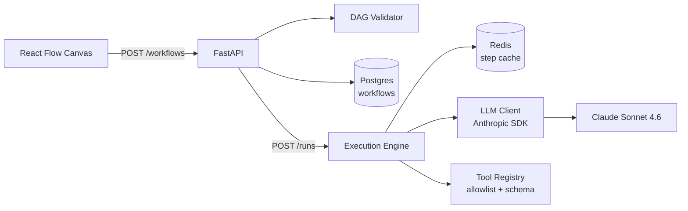

<div align="center">

# Agentic Workflow Builder

**Visual drag-and-drop builder for LLM agent workflows.**
Author flows in the browser. Persist as JSON. Execute step-by-step with caching.
Like a tiny LangGraph, but yours.

[](https://www.python.org/)
[](https://fastapi.tiangolo.com/)
[](https://www.typescriptlang.org/)
[](https://react.dev/)
[](https://reactflow.dev/)
[](https://www.anthropic.com/)
[](#status)

</div>

---

## What it is

A self-hosted, **opinionated** workflow engine for LLM agents.

- Draw your agent's flow in a visual canvas — nodes are LLM calls or tool calls, edges are dependencies.
- The workflow is just JSON, stored in Postgres, versionable in git.
- An async execution engine runs steps in topological order, caches outputs by input hash, validates everything against Pydantic.
- Prompt injection defense and tool allowlisting are first-class, not bolted on.

It is **not** a hosted SaaS. It is **not** trying to be LangGraph or LangChain. It is the smallest possible thing that lets one person build, run, and trust an agent workflow end-to-end.

## Architecture



## Project layout

```
.
├── src/agentic_workflow_builder/   # Python backend
│   ├── api.py                      # FastAPI app + routes
│   ├── models.py                   # Pydantic contracts (SPEC.md §1)
│   ├── validation.py               # DAG validation (pure)
│   ├── config.py                   # Settings (env vars)
│   └── db.py                       # SQLAlchemy async + Postgres
├── alembic/                        # DB migrations
├── tests/                          # Pytest (unit + integration via testcontainers)
├── frontend/                       # React + Vite + Tailwind + React Flow
│   ├── src/
│   ├── package.json
│   └── vite.config.ts              # /api proxy → :8000
├── docker-compose.yml              # Postgres + Redis (local dev)
├── SPEC.md                         # MVP contract — read this first
├── Makefile                        # Single entry point for everything
└── pyproject.toml
```

## Quick start

> Requires: Python 3.13 (`pyenv install 3.13`), [uv](https://docs.astral.sh/uv/), [pnpm](https://pnpm.io/), Docker Desktop.

```bash
# 1. Backend deps
make install

# 2. Spin up Postgres + Redis
make infra-up

# 3. Apply DB schema
uv run alembic upgrade head

# 4. Boot the API
uv run uvicorn agentic_workflow_builder.api:app --reload
# → http://localhost:8000/docs

# 5. In another terminal — frontend
make fe-dev
# → http://localhost:5173
```

Copy `.env.example` to `.env` and add your `ANTHROPIC_API_KEY` before running real workflows.

## Development

| Task                | Command                       |
|---------------------|-------------------------------|
| Install deps        | `make install`                |
| Lint                | `make lint`                   |
| Format              | `make format`                 |
| Type check (strict) | `make type`                   |
| Test                | `make test`                   |
| All checks          | `make all`                    |
| Infra up / down     | `make infra-up` / `infra-down`|
| Frontend dev        | `make fe-dev`                 |
| Frontend build      | `make fe-build`               |
| Frontend lint       | `make fe-lint`                |

## Status

This is an MVP under active construction. Built in vertical slices.

| Slice | Scope                                                | Status |
|-------|------------------------------------------------------|--------|
| 0     | Project scaffold (Python, FE, Docker, CI-ready)      | Done   |
| 1     | Workflow CRUD + DAG validation                       | Done   |
| 2     | Execution engine + LLM client + tool registry + cache + `POST /runs` | Next   |
| 3     | Frontend canvas wired to backend (save/load/run)     | Pending |
| 4     | Polish: error UI, run history view, prompt library   | Pending |

See [`SPEC.md`](./SPEC.md) for the authoritative MVP contract — endpoint shapes, LLM output schema, prompt injection defense, testing strategy, and explicit V2 cuts.

## Design principles

- **Stable contracts, replaceable internals.** Pydantic schemas in `models.py` are the API. Everything else is free to evolve.
- **Dependency injection at boundaries.** `LLMClient`, `ToolRegistry`, DB session — all injected, all fakeable.
- **Untrusted input is structurally isolated.** User data is wrapped in `<user_data>` XML tags before reaching the model; tool calls go through a server-side allowlist with per-tool Pydantic arg schemas.
- **Cache is correctness-first.** Step outputs are cached by `sha256(model + system + resolved_prompt)`. Cache writes happen only after Pydantic validation passes.
- **No speculative generality.** Workflows are sequential-per-dependency DAGs. Branching, loops, parallel fan-out are explicit V2.

## License

TBD.
